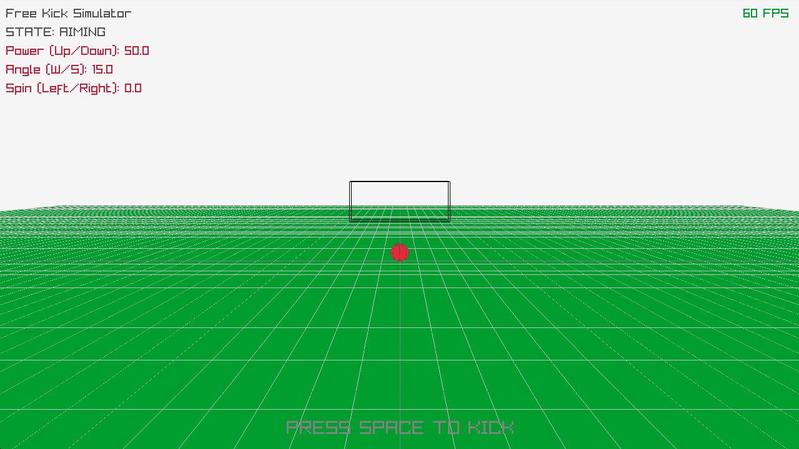

# 3D Free Kick Simulator

A 3D Free Kick simulator built with C++ and the Raylib library. This project uses dynamic memory management and vector math to simulate realistic ball trajectories and spin.

This project was developed as an independent project to demonstrate skills in C++ and real-time physics simulation.

## Preview

  

## Downloads

You can download a ready-to-play version for Windows from the official releases page. No installation or compilation needed!

**[➡️ Download the latest release here](https://github.com/Jinmamak/3D-Free-Kick-Simulator/releases)**

_(Remember to replace the link above with your actual GitHub repository link after you create the release!)_

## Features

- **Realistic Physics:** Simulates hundreds of trajectories per second, incorporating gravity, air resistance (drag), and the Magnus effect for accurate ball spin.
- **Interactive Controls:** Allows the user to adjust kick strength, angle, and spin in real-time.
- **Responsive Visuals:** Integrated with Raylib to provide smooth visual feedback at 60+ FPS.
- **Collision Dynamics:** Includes basic collision detection for the ground (with bounce physics) and the goal.

## How to Compile (for Developers)

This project is based on a Visual Studio Code template for Raylib.

1.  Ensure you have followed the setup instructions for the Raylib VS Code template (i.e., Raylib is located at `C:/raylib/`).
2.  Open the project folder in Visual Studio Code.
3.  Open the `main.cpp` file.
4.  Press `F5` to compile and run the project.

## Controls

- **Power:** `UP` / `DOWN` arrow keys
- **Angle:** `W` / `S` keys
- **Spin:** `LEFT` / `RIGHT` arrow keys
- **Kick:** `SPACEBAR`
- **Reset:** `ENTER`
